# MTA for Java Workshop 

Docker EE 2.0 is the first Containers-as-a-Service platform to offer production-level support for the integrated management and security of both Linux and Windows Server Containers. It is also the first platform to support both Docker Swarm and Kubernetes orchestration.

In this lab we'll use a Docker EE cluster. We'll initially deploy both a Java n-tier web app and modernize it into multi-service application using Docker Swarm. Then we'll take a look at securing and scaling the application. Finally, we will then deploy the app using Kubernetes.

> **Difficulty**: Intermediate (assumes basic familiarity with Docker) If you're looking for a basic introduction to Docker, check out [https://training.play-with-docker.com](https://training.play-with-docker.com)

> **Time**: Approximately 75 minutes

> **Introduction**:
>	* [What is the Docker Platform](#intro1)
>	* [Overview of Orchestration](#intro2)
>		* [Basics of Docker Swarm mode](#intro2.1)
>		* [Basics of Kubernetes](#intro2.2)

> **Tasks**:

> * [Task 1: Configure the Docker EE Cluster](#task1)
>   * [Task 1.1: Accessing PWD](#task1.1)
>   * [Task 1.2: Install a Windows worker node](#task1.2)
>   * [Task 1.3: Create Five Repositories](#task1.3)
> * [Task 2: Deploy a Java Web App with Universal Control Plane](#task2)
>   * [Task 2.1: Clone the Demo Repo](#task2.1)
>   * [Task 2.2: Building the Web App and Database Images](#task2.2)
>   * [Task 2.3: Building and Pushing the Application to DTR](#task2.3)
>   * [Task 2.4: Deploy the Web App using UCP](#task2.4)
> * [Task 3: Modernizing with Microservices](#task3)
>   * [Task 3.1: Building the Microservices Images](#task3.1)
>   * [Task 3.2: Push to DTR](#task3.2)
>   * [Task 3.3: Run the Application in UCP](#task3.3)
> * [Task 4: Adding Logging and Monitoring](#task4)
>   * [Task 4.1: Add Data](#task4.1)
>   * [Task 4.2: Display Data on Kibana](#task4.2)
> * [Task 5: Orchestration with Docker Swarm](#task5)
>   * [Task 5.1: Building the Javascript Client](#task5.1)
>   * [Task 5.2: Deploying on a Running Cluster](#task5.2)
> * [Task 6: Deploying on Kubernetes](#task6)]

## Understanding the Play With Docker Interface


This workshop is only available to people in a pre-arranged workshop. That may happen through a [Docker Meetup](https://events.docker.com/chapters/), a conference workshop that is being led by someone who has made these arrangements, or special arrangements between Docker and your company. The workshop leader will provide you with the URL to a workshop environment that includes [Docker Enterprise Edition](https://www.docker.com/enterprise-edition). The environment will be based on [Play with Docker](https://labs.play-with-docker.com/).

If none of these apply to you, contact your local [Docker Meetup Chapter](https://events.docker.com/chapters/) and ask if there are any scheduled workshops. In the meantime, you may be interested in the labs available through the [Play with Docker Classroom](training.play-with-docker.com).

There are three main components to the Play With Docker (PWD) interface. 

### 1. Console Access
Play with Docker provides access to the 3 Docker EE hosts in your Cluster. These machines are:

* A Linux-based Docker EE 18.01 Manager node
* Three Linux-based Docker EE 18.01 Worker nodes

> **Important Note: beta** Please note, as of now, this is a Docker EE 2.0 environment. Docker EE 2.0 shows off the new Kubernetes functionality which is described below.

By clicking a name on the left, the console window will be connected to that node.

### 2. Access to your Universal Control Plane (UCP) and Docker Trusted Registry (DTR) servers

Additionally, the PWD screen provides you with a one-click access to the Universal Control Plane (UCP)
web-based management interface as well as the Docker Trusted Registry (DTR) web-based management interface. Clicking on either the `UCP` or `DTR` button will bring up the respective server web interface in a new tab.

### 3. Session Information

Throughout the lab you will be asked to provide either hostnames or login credentials that are unique to your environment. These are displayed for you at the bottom of the screen.

## Document conventions

- When you encounter a phrase in between `<` and `>`  you are meant to substitute in a different value.

	For instance if you see `<dtr hostname>` you would actually type something like `ip172-18-0-7-b70lttfic4qg008cvm90.direct.ee-workshop.play-with-docker.com`

## <a name="intro1"></a>Introduction

Docker EE provides an integrated, tested and certified platform for apps running on enterprise Linux or Windows operating systems and Cloud providers. Docker EE is tightly integrated to the the underlying infrastructure to provide a native, easy to install experience and an optimized Docker environment. Docker Certified Infrastructure, Containers and Plugins are exclusively available for Docker EE with cooperative support from Docker and the Certified Technology Partner.

### <a name="intro2"></a>Overview of Orchestration

While it is easy to run an application in isolation on a single machine, orchestration allows you to coordinate multiple machines to manage an application, with features like replication, encryption, loadbalancing, service discovery and more. If you've read anything about Docker, you have probably heard of Kubernetes and Docker swarm mode. Docker EE allows you to use either Docker Swarm mode or Kubernetes for orchestration. 

Both Docker Swarm mode and Kubernetes are declarative: you declare your cluster's desired state, and applications you want to run and where, networks, and resources they can use. Docker EE simplifies this by taking common concepts and moving them to the a shared resource.

#### <a name="intro2.1"></a>Overview of Docker Swarm mode

A swarm is a group of machines that are running Docker and joined into a cluster. After that has happened, you continue to run the Docker commands you’re used to, but now they are executed on a cluster by a swarm manager. The machines in a swarm can be physical or virtual. After joining a swarm, they are referred to as nodes.

Swarm mode uses managers and workers to run your applications. Managers run the swarm cluster, making sure nodes can communicate with each other, allocate applications to different nodes, and handle a variety of other tasks in the cluster. Workers are there to provide extra capacity to your applications. In this workshop, you have one manager and three workers.

#### <a name="intro2.2"></a>Overview of Kubernetes

Kubernetes is available in Docker EE 2.0 and included in this workshop. Kubernetes deployments tend to be more complex than Docker Swarm, and there are many component types. UCP simplifies a lot of that, relying on Docker Swarm to handle shared resources. We'll concentrate on Pods and Load Balancers in this workshop, but there's plenty more supported by UCP 2.0.

## <a name="task1"></a>Task 1: Configure the Docker EE Cluster

The Play with Docker (PWD) environment is almost completely set up, but before we can begin the labs, we need to do two more steps. First we'll create repositories in Docker Trusted Registry.

### <a name="task 1.1"></a>Task 1.1: Accessing PWD

1. Navigate in your web browser to the URL the workshop organizer provided to you.

2. Fill out the form, and click `submit`. You will then be redirected to the PWD environment.

	It may take a few minutes to provision out your PWD environment. After this step completes, you'll be ready to move on to task 1.2: Install a Windows worker node

	> In a production environment you would use certs from a trusted certificate authority and would not see this screen.
	>
	> 

2. When prompted enter your username and password (these can be found below the console window in the main PWD screen). The UCP web interface should load up in your web browser.

	> **Note**: Once the main UCP screen loads you'll notice there is a red warning bar displayed at the top of the UCP screen, this is an artifact of running in a lab environment. A UCP server configured for a production environment would not display this warning
	>
	> 


### <a name="task1.3"></a>Task 1.3: Create Five DTR Repositories

Docker Trusted Registry is a special server designed to store and manage your Docker images. In this lab we're going to create five different Docker images, and push them to DTR. But before we can do that, we need to setup repositories in which those images will reside. Often that would be enough.

However, before we create the repositories, we do want to restrict access to them. Since we have two distinct app components, a front end Java web app, and a set of back end services, we want to restrict access to them to the team that develops them, as well as the administrators. To do that, we need to create two users and then two organizations.

1. In the PWD web interface click the `DTR` button on the left side of the screen.

	> **Note**: As with UCP before, DTR is also using self-signed certs. It's safe to click through any browser warning you might encounter.

2. From the main DTR page, click users and then the New User button.

	

3. Create a new user, `frontend_user` and give it a password you'll remember. I used `user1234`. Be sure to save the user.

	

	Then do the same for a `backend_user`.

4. Select the Organization button.

	

5. Press New organization button, name it `frontend`, and click save.

	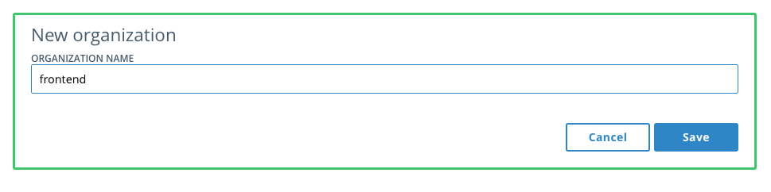

	Then do the same with `backend` and you'll have two organizations.

	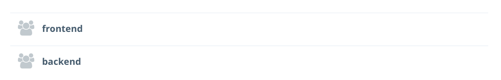

6. Now you get to add a repository! Click on the `frontend` organization, select repositories and then Add repository

	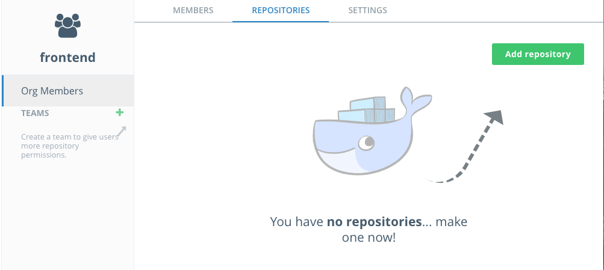

7. Name the repository `java_web`.

	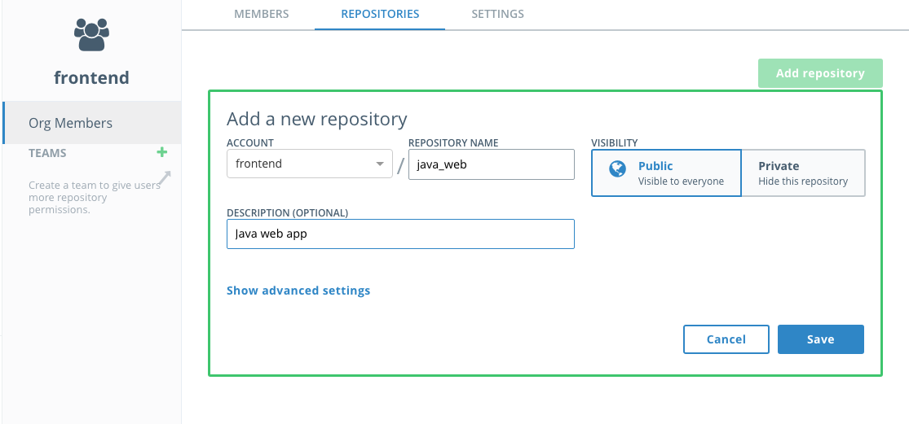

	> Note the repository is listed as "Public" but that means it is publicly viewable by users of DTR. It is not available to the general public.

8. Now it's time to create a team so you can restrict access to who administers the images. Select the `frontend` organization and the members will show up. Press Add user and start typing in frontend. Select the `frontend_user` when it comes up.

	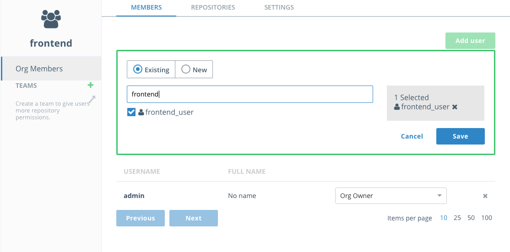

9. Next select the `frontend` organization and press the `Team` button to create a `web` team.

	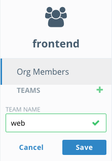

10. Add the `frontend_user` user to the `web` team and click save.

	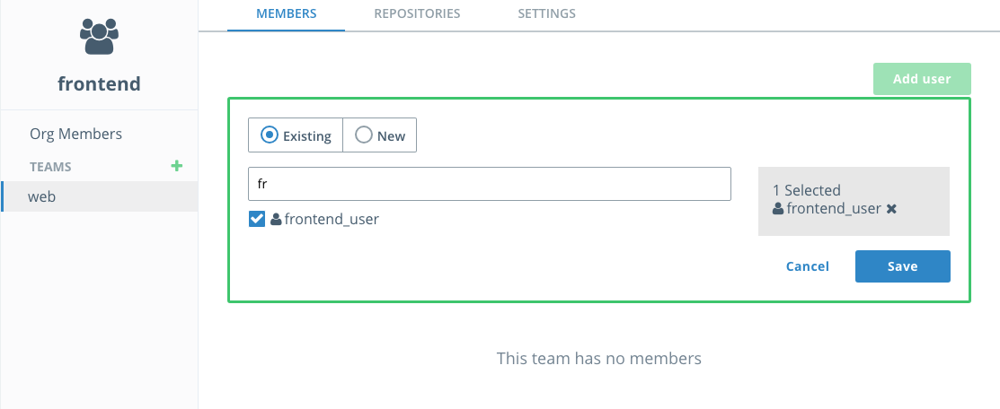

	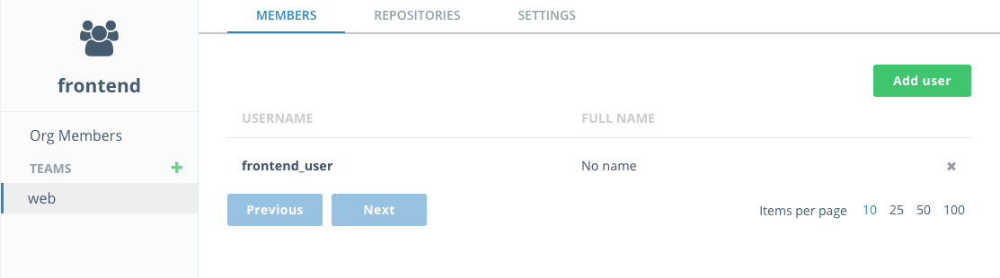

11. Next select the `web` team and select the `Repositories` tab. Select `Add Existing repository` and choose the `java_web`repository. You'll see the `java` account is already selected. Then select `Read/Write` permissions so the `web` team has permissions to push images to this repository. Finally click `save`.

	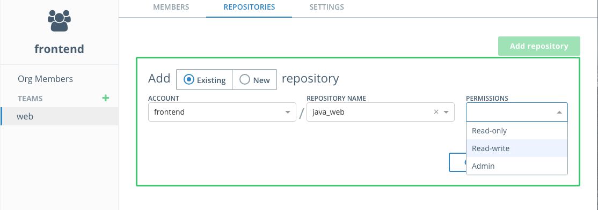

12. Now add a new repository also owned by the web team and call it `signup_client`. This can be done directly from the web team's `Repositories` tab by selecting the radio button for Add `New` Repository. Be sure to grant `Read/Write` permissions for this repository to the `web` team as well.

	

13. Repeat steps 4-11 above to create a `backend` organization with repositories called `database`, `messageservice` and `worker`. Create a team named `services` (with `backend_user` as a member). Grant `read/write` permissions for the `database`,`messageservice` and `worker` repositories to the `services` team.

14. From the main DTR page, click Repositories, you will now see all three repositories listed.
	
	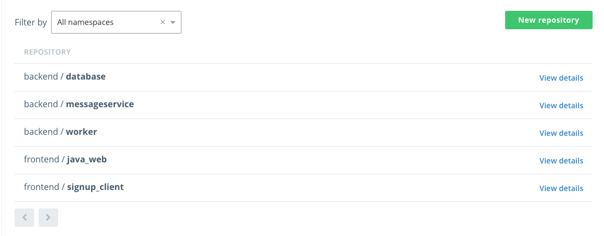

15. (optional) If you want to check out security scanning in Task 5, you should turn on scanning now so DTR downloads the database of security vulnerabilities. In the left-hand panel, select `System` and then the `Security` tab. Select `ENABLE SCANNING` and `Online`.

	

Congratulations, you have created five new repositories in two new organizations, each with one team and a user each.

## <a name="task2"></a>Task 2: Deploy a Java Web App with Universal Control Plane
Now that we've completely configured our cluster, let's deploy a couple of web apps. The first app is a basic Java CRUD (Create Read Update Delete) application in Tomcat that writes to a MySQL database. 

### <a name="task2.1"></a> Task 2.1: Clone the Repository

1. From PWD click on the `worker1` link on the left to connect your web console to the UCP Linux worker node.

2. Before we do anything, let's configure an environment variable for the DTR URL/DTR hostname. You may remember that the session information from the Play with Docker landing page. Select and copy the the URL for the DTR hostname.

	

3. Set an environment variable `DTR_HOST` using the DTR host name defined on your Play with Docker landing page:

	```bash
	$ export DTR_HOST=<DTR hostname>
	$ echo $DTR_HOST
	```
4. Set an environment variable `UCP_HOST` using the DTR host name defined on your Play with Docker landing page:

	```bash
	$ export UCP_HOST=<UCP hostname>
	$ echo $UCP_HOST
	```

5. Now use git to clone the workshop repository.

	```bash
	$ git clone https://github.com/dockersamples/mta_java_workshop.git
	```

	You should see something like this as the output:

	```bash
	Cloning into 'mta_java_workshop'...
	remote: Counting objects: 389, done.
	remote: Compressing objects: 100% (17/17), done.
	remote: Total 389 (delta 4), reused 16 (delta 1), pack-reused 363
	Receiving objects: 100% (389/389), 13.74 MiB | 3.16 MiB/s, done.
	Resolving deltas: 100% (124/124), done.
	Checking connectivity... done.
	```

	You now have the necessary code on your worker host.

#### OPTIONAL

If you have git installed on your computer, cloning the repository to a local directory will simplify some steps by letting you upload files instead of copying and pasting from the tutorial.

### <a name="task2.2"></a> Task 2.2: Building the Web App and Database Images

As a first step, we'll containerize the application without changing existing code to test the concept of migrating the application to a container architecture. We'll do this by building the application from the source code and deploying it in the same application server used in production.  The code for containerizing the application can be found in the [part_2](./part_2) directory. Additionally, I'll configure and deploy the database.

Docker simplifies containerization with a Dockerfile, which is a text document that contains all the commands a user could call on the command line to assemble an image. Using `docker image build` users can create an automated build that executes several command-line instructions in succession.

With a Dockerfile, we'll perform a multi-stage where the code will be compiled and packaged using a container running maven.  All dependencies and jar files are downloaded to the maven container based on the pom.xml file. The tool chain to build the application is completely in the maven container and not local to your development environment. The output of this step is a Web Archive or WAR file that's ready for deployment in an application server. All builds will be exactly the same regardless of the development environment.

```
FROM maven:latest AS devenv
WORKDIR /usr/src/signup 
COPY app/pom.xml .
RUN mvn -B -f pom.xml -s /usr/share/maven/ref/settings-docker.xml dependency:resolve
COPY ./app .
RUN mvn -B -s /usr/share/maven/ref/settings-docker.xml package -DskipTests
```

The second part of the multi-stage build deploys the application in a Java application server. I'm using Tomcat in this tutorial but the process is the same for any other application service. This part of the build configures Tomcat by adding custom configuration files, copying needed jars such as the MySQL JDBC connector, and the application packaged as a WAR file.

```
FROM tomcat:7-jre8
LABEL maintainer="Sophia Parafina <sophia.parafina@docker.com>"

# tomcat-users.xml sets up user accounts for the Tomcat manager GUI
ADD tomcat/tomcat-users.xml $CATALINA_HOME/conf/

# ADD tomcat/catalina.sh $CATALINA_HOME/bin/
ADD tomcat/run.sh $CATALINA_HOME/bin/run.sh
RUN chmod +x $CATALINA_HOME/bin/run.sh

# add MySQL JDBC driver jar
ADD tomcat/mysql-connector-java-5.1.36-bin.jar $CATALINA_HOME/lib/

# create mount point for volume with application
WORKDIR $CATALINA_HOME/webapps/
COPY --from=devenv /usr/src/signup/target/java-web.war .

# start tomcat7 with remote debugging
EXPOSE 8080
CMD ["run.sh"]
```

Building the database container follows a similar patter, including creating the database schema.

```
FROM mysql:latest

# Contents of /docker-entrypoint-initdb.d are run on mysqld startup
ADD  docker-entrypoint-initdb.d/ /docker-entrypoint-initdb.d/

# Default values for passwords and database name. Can be overridden on docker run
ENV MYSQL_DATABASE=signup
ENV MYSQL_USER=gordon
ENV MYSQL_PASSWORD=password
```

### <a name="task2.3"></a> Task 2.3: Building and Pushing the Application to DTR

1. Change into the `java_app` directory.

	```bash
	$ cd ./part_2/java_app/
	```

2. Use `docker build` to build your Docker image.

	```bash
	$ docker build -t $DTR_HOST/frontend/java_web .
	```

	The `-t` tags the image with a name. In our case, the name indicates which DTR server and under which organization's repository the image will live.

	> **Note**: Feel free to examine the Dockerfile in this directory if you'd like to see how the image is being built.

	There will be quite a bit of output. The Dockerfile describes a two-stage build. In the first stage, a Maven base image is used to build the Java app. But to run the app you don't need Maven or any of the JDK stuff that comes with it. So the second stage takes the output of the first stage and puts it in a much smaller Tomcat image.

3. Log into your DTR server from the command line.
 
	First use the `backend_user`, which isn't part of the frontend organization

	```bash
	$ docker login $DTR_HOST
	Username: <your username>
	Password: <your password>
	Login Succeeded
	```
	
	Use `docker push` to upload your image up to Docker Trusted Registry.
	
	```bash
	$ docker push $DTR_HOST/frontend/java_web
	```
	
	> TODO: add output of failure to push

	```bash
	$ docker push $DTR_HOST/frontend/java_web
	The push refers to a repository [.<dtr hostname>/frontend/java_web]
	8cb6044fd4d7: Preparing
	07344436fe27: Preparing
	...
	e1df5dc88d2c: Waiting
	denied: requested access to the resource is denied
	```

	As you can see, the access control that you established in the [Task 1.3](#task1.3) prevented you from pushing to this repository.	

4. Now try logging in using `frontend_user`, and then use `docker push` to upload your image up to Docker Trusted Registry.

	```bash
	$ docker push $DTR_HOST/frontend/java_web
	```

	The output should be similar to the following:

	```bash
	The push refers to a repository [<dtr hostname>/java/java_web]
	feecabd76a78: Pushed
	3c749ee6d1f5: Pushed
	af5bd3938f60: Pushed
	29f11c413898: Pushed
	eb78099fbf7f: Pushed
	latest: digest: sha256:9a376fd268d24007dd35bedc709b688f373f4e07af8b44dba5f1f009a7d70067 size: 1363
	```

	Success! Because you are using a user name that belongs to the right team in the right organization, you can push your image to DTR.

5. In your web browser head back to your DTR server and click `View Details` next to your `java_web` repository to see the details.

	> **Note**: If you've closed the tab with your DTR server, just click the `DTR` button from the PWD page.

6. Click on `Images` from the horizontal menu. Notice that your newly pushed image is now on your DTR.

	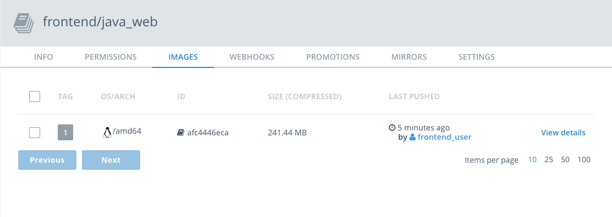

7. Next, build the MySQL database image. Change into the database directory.

```bash
	$ cd ../database
```

8. Use `docker build` to build your Docker image.

	```bash
	$ docker build -t $DTR_HOST/backend/database .
	```

9. Login in as `backend_user` and use `docker push` to upload your image up to Docker Trusted Registry.
	```bash
	$ docker push $DTR_HOST/backend/database
	```

10. In your web browser head back to your DTR server and click `View Details` next to your `database` repo to see the details of the repo.

11. Click on `Images` from the horizontal menu. Notice that your newly pushed image is now on your DTR.
images


### <a name="task2.4"></a> Task 2.4: Deploy the Web App using UCP

Docker automates the process of building and running the application from a single file using Docker Compse. Compose is a tool for declaratively  defining and running multi-container Docker applications. With Compose, a YAML file configures the application’s services. Then, with a single command, all the services are configured, created and started.

We'll go through the Compose [file](./part_2/docker-compose.yml) 

```yaml
    version: "3.3"

    services:

      database:
        image: <$DTR_HOST>/backend/database
        # set default mysql root password, change as needed
        environment:
          MYSQL_ROOT_PASSWORD: mysql_password
        # Expose port 3306 to host. 
        ports:
          - "3306:3306" 
        networks:
          - back-tier
```

In the section above, We pull the database container from DTR. We can also pass environmental variables such as the password and the port, and name the image using the `image:` directive.

```yaml
      webserver:
        image: <$DTR_HOST>/frontend/java_web
        ports:
          - "8080:8080" 
        networks:
          - front-tier
          - back-tier
```

In this section, the java_web application is pulled from DTR and named the service is named `webserver`. As in the database, the external port is set.

```yaml
    networks:
	  back-tier:
	    external: true
	  front-tier:
	    external: true
```

In this section, two networks are defined, the back-tier network isolates backend components from components on the front-tier network. This seems unnecessary in this current configuration but we'll make use of the networks in later iterations.

The next step is to run the app in Swarm. As a reminder, the application has two components, the web front-end and the database. In order to connect to the database, the application needs a password. If you were just running this in development you could easily pass the password around as a text file or an environment variable. But in production you would never do that. So instead, we're going to create an encrypted secret. That way access can be strictly controlled.

1. Go back to the first Play with Docker tab. Click on the UCP button. You'll have the same warnings regarding `https` that you have before. Click through those and log in. You'll see the Universal Control Panel dashboard.

2.  There's a lot here about managing the cluster. You can take a moment to explore around. When you're ready, click on `Swarm` and select `Secrets`.

	

3. You'll see a `Create Secret` screen. Type `mysql_root_password` in `Name` and `Dockercon!!!` in `Content`. Then click `Create` in the lower left. Obviously you wouldn't use this password in a real production environment. You'll see the content box allows for quite a bit of content, you can actually create structured content here that will be encrypted with the secret.

	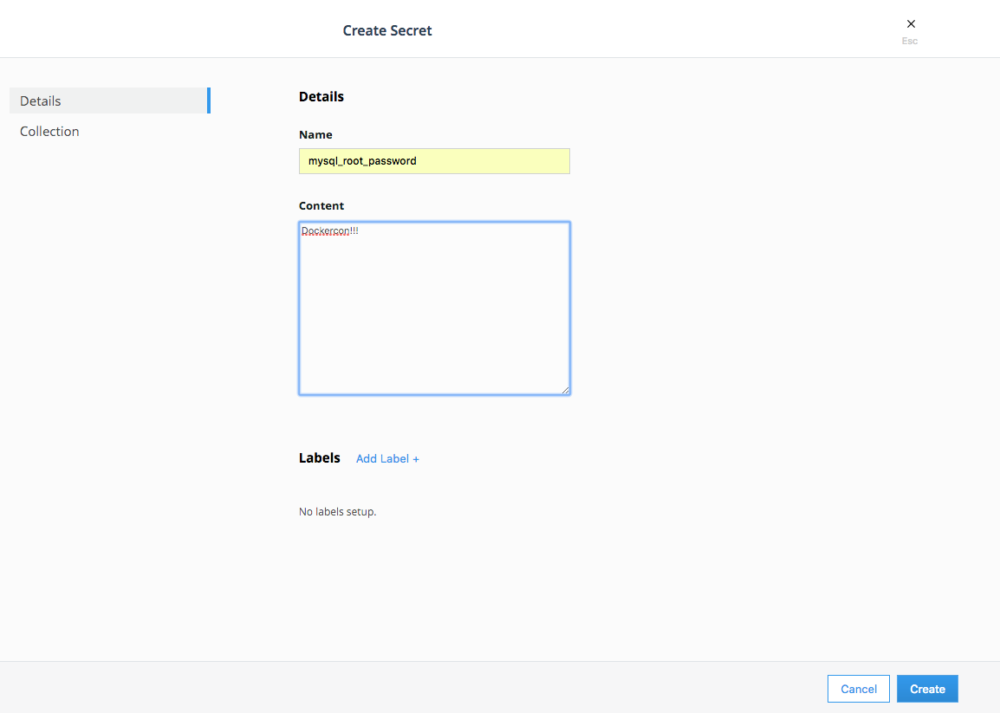

4. Next we're going to create two networks. First click on `Networks` under `Swarm` in the left panel, and select `Create Network` in the upper right. You'll see a `Create Network` screen. Name your first network `back-tier`. Leave everything else the default.

	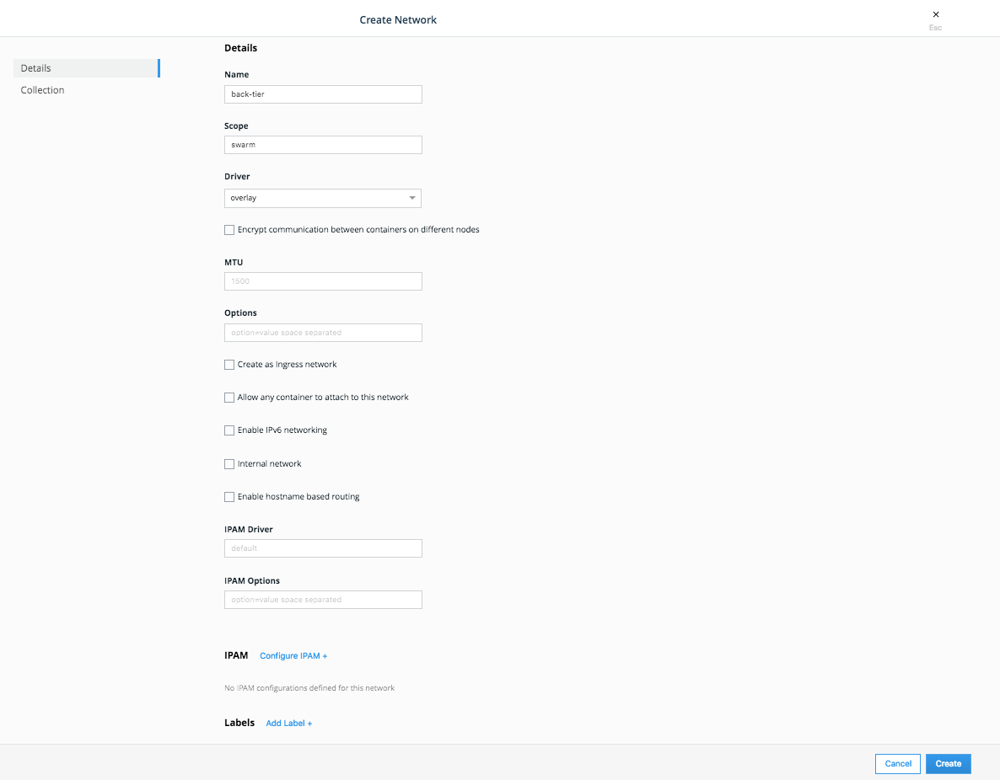

5. Repeat step 4 but with a new network `front-tier`.

6. Now we're going to use the fast way to create your application: `Stacks`. In the left panel, click `Shared Resources`, `Stacks` and then `Create Stack` in the upper right corner.

7. Name your stack `java_web` and select `Swarm Services` for your `Mode`. Below is a `.yml` file. Before you paste that in to the `Compose.yml` edit box, note that you'll need to make a quick change. Each of the images is defined as `<dtr hostname>/frontend/<something>`. You'll need to change the `<dtr hostname>` to the DTR Hostname found on the Play with Docker landing page for your session. It will look something like this:
`ip172-18-0-21-baeqqie02b4g00c9skk0.direct.ee-beta2.play-with-docker.com`
You can do that right in the edit box in `UCP` but make sure you saw that first.

	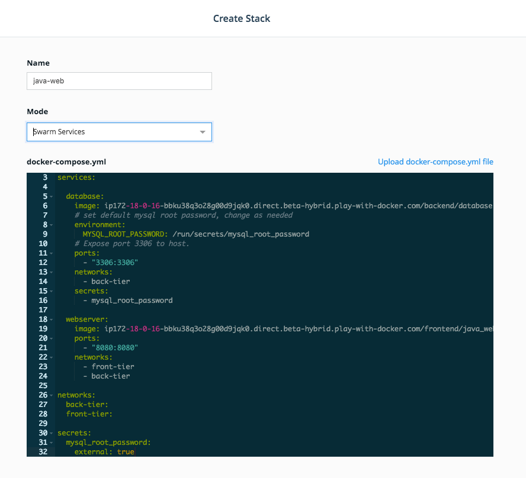

	Here's the `Compose` file. Once you've copy and pasted it in, and made the changes, click `Create` in the lower right corner.

```yaml
version: "3.3"

services:

  database:
    image: <$DTR_HOST>/backend/database
    # set default mysql root password, change as needed
    environment:
      MYSQL_ROOT_PASSWORD: /run/secrets/mysql_root_password
    # Expose port 3306 to host. 
    ports:
      - "3306:3306" 
    networks:
      - back-tier
    secrets:
      - mysql_root_password

  webserver:
    image: <$DTR_HOST>/frontend/java_web:1
    ports:
      - "8080:8080" 
    networks:
      - front-tier
      - back-tier

networks:
  back-tier:
    external: true
  front-tier:
    external: true

secrets:
  mysql_root_password:
    external: true
```

Then click `Done` in the lower right.

8. Click on `Stacks` again, and select the `java_web` stack. Click on `Inspect Resources` and then select `Services`. Select `java_web_webserver`. In the right panel, you'll see `Published Endpoints`. Select the one with `:8080` at the end. You'll see a `Apache Tomcat/7.0.84` landing page. Add `/java-web` to the end of the URL and you'll see the app.

	

9. Delete the `java_web` stack.

## <a name="task3"></a>Task 3: Modernizing with Microservices

Now that we have stable build process, we can start migrating from a N-tier architecture to a service oriented architecture. We'll do this piece wise by picking features that can be easily broken off into a services.

One of the problems associated with Java CRUD applications is that database operations can be expensive in terms of fetching and reading data from I/O and memory. Applications that frequently write to a synchronous database can cause a bottleneck. One way to make the application more efficient is to use a message queue. We can publish an event from the Web app to a message queue and move the data-persistence code into a new component that handles that event message. If there is a spike of traffic to the web site, we can add more containers on more nodes to cope with the incoming requests. Event messages will be held in the queue until the message handler consumes them.

 The message queue is implemented by adding a RESTful microservice that writes the user data to a Redis database that stores the information. If you’re not familiar with Redis, it’s an in memory key-value store that’s great for saving abstract data types such as JSON lists. Note that we could use any other key-value datastore in place of Redis, such as memcached or MongoDB.

The [messageservice](./part_3/messageservice) uses the Spring Boot framework. Spring Boot was chosen because it has many advantages such as handling the database connections transparently, implementing both a MVC architecture and RESTful interfaces is simplified, and it includes a built-in application server in the form of Tomcat. Another factor in choosing Spring Boot is that it has good support for Redis.  We could continue to use Spring as in the original application, but all of these advantages simplifies configuration and deployment.

The message service is an MVC application that uses the same User entity model in the original application. It consists of a repository for interacting with  Redis, a service that handles the connection and transport, and a controller for the REST endpoint.

The next piece is a [worker microservice](./part_3/worker) that retrieves the user data stored in Redis and writes the data to the MySQL database. The worker is a Plain Old Java Object, or POJO, that pulls the data from Redis using the blpop method. This method allows the worker to to pop data from the queue without constantly checking the status of the queue. Blpop works like a one time trigger that fires when data gets placed in the queue. Setting up the communication between the application and the worker establishes a reliable and fast queuing system.

We're adding three new components to the application - a Redis instance, the messageservice and the worker that writes to the database. There are Dockerfiles for both the [messageservice](./part_3/messageservice/Dockerfile) and the [worker](./part_3/worker/Dockerfile) to build them as images. Since Spring Boot includes Tomcat and the worker is just a jar file, we can build and deploy both components in a Java container.


## <a name="task3.1"></a>Task 3.1: Building the Microservices Images

1. Build the message service that writes to Redis.

```bash
$ cd ./part_3/messageservice
$ docker image build $DTR_HOST/backend/messageservice .
```

2. Build the worker service that reads from writes to MySQL.

```bash
$ cd ../part_3/worker
$ docker image build $DTR_HOST/backend/messageservice .
```

3. One last thing, we'll need to modify the code in the original application to send the user data from the form to messageservice instead of writing it to the database directly. The main change in the code is that the data is posted to the messageservice instead of MySQL.

Build the Java application and tag it with version 2.

```bash
$ cd ./part3/java_app
$ docker image build -t $DTR_HOST/backend/java_web:2 .
```

## <a name="task3.2"></a>Task 3.2: Push to DTR

1. Login as backend to DTR and push the messageservice and worker images.

```bash
	$ docker login $DTR_HOST
	Username: <your username>
	Password: <your password>
	Login Succeeded

	$ docker push $DTR_HOST/backend/messageservice
    $ docker push $DTR_HOST/backend/worker
```

2. Login as frontend to DTR and push the java_web:2 image.

```bash
	$ docker login $DTR_HOST
	Username: <your username>
	Password: <your password>
	Login Succeeded

	$ docker push $DTR_HOST/frontend/java_web:2
```

## <a name="task3.3"></a>Task 3.3: Run the Application in UCP

Adding microservices adds complexity to deployment and maintenance when compared to a monolithic application comprised of only a application server and a database. But we’ll use Docker to easily deploy, manage and maintain these additional services. One component that's not in DTR is Redis, a Dockerfile is not needed because we'll use official Redis image without any additional configuration.

To run the application, create a new stack using this compose file:

```yaml
version: "3.3"

services:

  database:
    image: <$DTR_HOST>/backend/database
    enviro
      - "3306:3306"
    networks:
      - back-tier
    secrets:
      - mysql_root_password

  webserver:
    image: <$DTR_HOST>/backend/java_web:2
    ports:
      - "8080:8080"
    environment:
      BASEURI: http://messageservice:8090/users
    networks:
      - front-tier
      - back-tier

  messageservice:
    image: <$DTR_HOST>/backend/messageservice
    ports:
      - "8090:8090"
    networks:
      - back-tier

  worker:
    image: <$DTR_HOST>/backend/worker
    networks:
      - back-tier

  redis:
    image: redis
    container_name: redis
    ports: 
      - "6379:6379"
    networks:
      - back-tier

networks:
  front-tier:
    external: true
  back-tier:
    external: true

secrets:
  mysql_root_password:
    external: truenment:
      MYSQL_ROOT_PASSWORD: /run/secrets/mysql_root_password
    ports:
```

## <a name="task4"></a>Task 4: Adding Logging and Monitoring

One of the advantages of splitting out a feature into a separate service is that it makes it easier to add new features. We'll take advantage of the new service interface to implement logging and monitoring.

We'll implement Elasticsearch and Kibana to collect and visualize data from the application. To gather the data for the reporting database in Elasticsearch, I’ve added code to the worker that listens to events published by the web application. The analytics worker receives the data and saves it in Elasticsearch which is running in Docker container. We're using Elasticsearch because it can be clustered across multiple containers for redundancy and it has Kibana, which is an excellent front-end for analytics.

We're not making changes to the application or the registration microservice, so we can just add new services for Elasticsearch and Kibana in the Docker Compose file. One of the features of Docker is that Docker Compose can incrementally upgrade an application. 

```
#logging
  elasticsearch:
    image: docker.elastic.co/elasticsearch/elasticsearch-oss:6.1.2
    container_name: elasticsearch
    ports:
      - "9200:9200"
      - "9300:9300"
    environment:
      ES_JAVA_OPTS: "-Xmx256m -Xms256m"
    networks: 
      - elk

  kibana:
    image: docker.elastic.co/kibana/kibana-oss:6.1.2
    container_name: kibana
    ports:
      - "5601:5601"
    networks: 
      - elk
    depends_on:
      - elasticsearch
```
### <a name="task4.1"></a>Task 4.1: Add Data
Adding these services won’t replace running containers if their definition matches the service in the Docker Compose file. Since the worker service has been updated Docker EE will run the containers for the Elasticsearch, Kibana. It will leave the other containers running as is,letting me add new features without taking the application offline.

To make the example more visually interesting, code to calculate the age of the person based on their birthday was added to to the worker microservice and a new image, tagged worker:2, was deployed to the cluster. To test it out, there is a small shell script that posts user data to the messageservice that will populate the database. To run the script:

```
$ ./firefly_data.sh
```
### <a name=task4.2></a>Task 4.2: Display Data on Kibana

Create a stack that includes the Elasticsearch and Kibanna

```yaml
version: "3.3"

services:

  database:
    image: <$DTR_HOST>/backend/database
    environment:
      MYSQL_ROOT_PASSWORD: /run/secrets/mysql_root_password
    ports:
      - "3306:3306"
    networks:
      - back-tier
    secrets:
      - mysql_root_password

  webserver:
    image: <$DTR_HOST>/frontend/java_web:2
    ports:
      - "8080:8080"
    environment:
      BASEURI: http://messageservice:8090/user
    networks:
      - front-tier
      - back-tier

  messageservice:
    image: <$DTR_HOST>/backend/messageservice
    ports:
      - "8090:8090"
    networks:
      - back-tier

  worker:
    image: <$DTR_HOST>/backend/worker:2
    networks:
      - back-tier

  redis:
    image: redis
    ports: 
      - "6379:6379"
    networks:
      - back-tier

#logging
  elasticsearch:
    image: docker.elastic.co/elasticsearch/elasticsearch-oss:6.1.2
    ports:
      - "9200:9200"
      - "9300:9300"
    environment:
      ES_JAVA_OPTS: "-Xmx256m -Xms256m"
    networks: 
      - back-tier

  kibana:
    image: docker.elastic.co/kibana/kibana-oss:6.1.2
    ports:
      - "5601:5601"
    networks: 
      - back-tier
      - front-tier
    depends_on:
      - elasticsearch

networks:
  front-tier:
    external: true
  back-tier:
    external: true

secrets:
  mysql_root_password:
    external: true
```

### <a name=task4.3></a>Task 4.3: Display Data on Kibana

We can use Kibana to index the data and look at the data. Go to `http:/<$UCP_HOST>:5601`

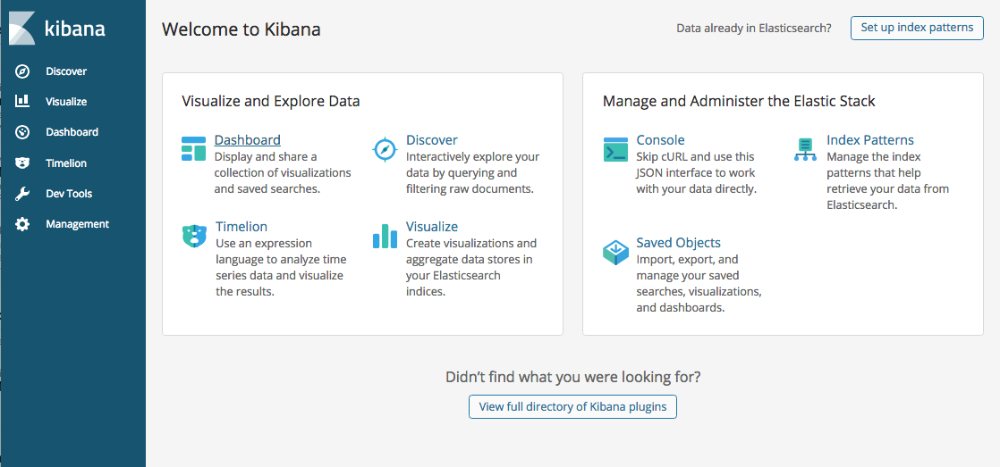

1. Index the data by clicking on `Management` in the menu bar on the left. Type `signup` as the Index patter and click `Next step`

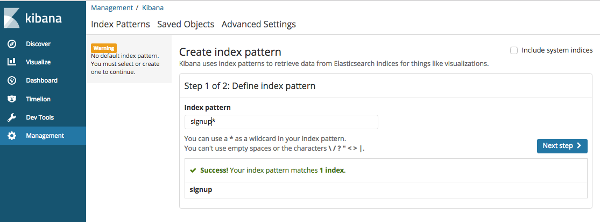

In Step 2 of 2 Configure settings, click on `Create index pattern`


All the fields associated with the index pattern are displayed. Note that an age field has been added to the user data when it was written to Elasticsearch by the worker service.

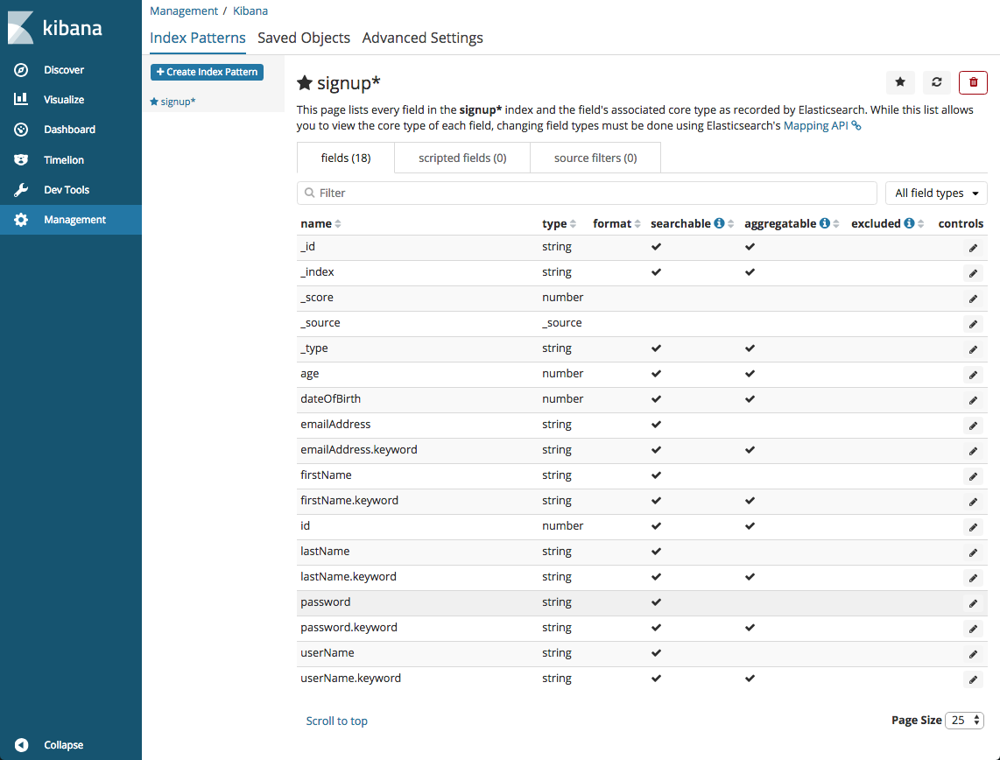

We can also inspect the data by clicking on `Discover` in the left menu bar.

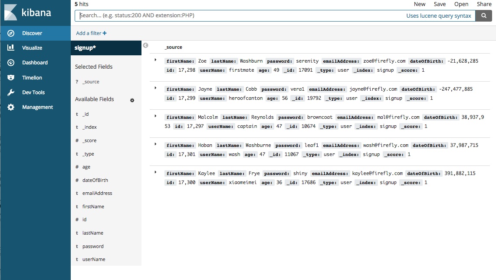

2. Create a visualization by clicking on `Visualize` in the left menu bar. 

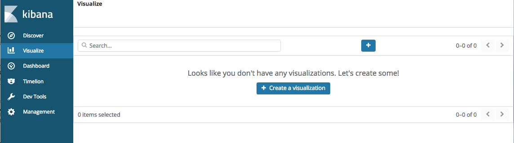

Next, select the visualization type, we'll use a `vertical bar` chart for the visualization.

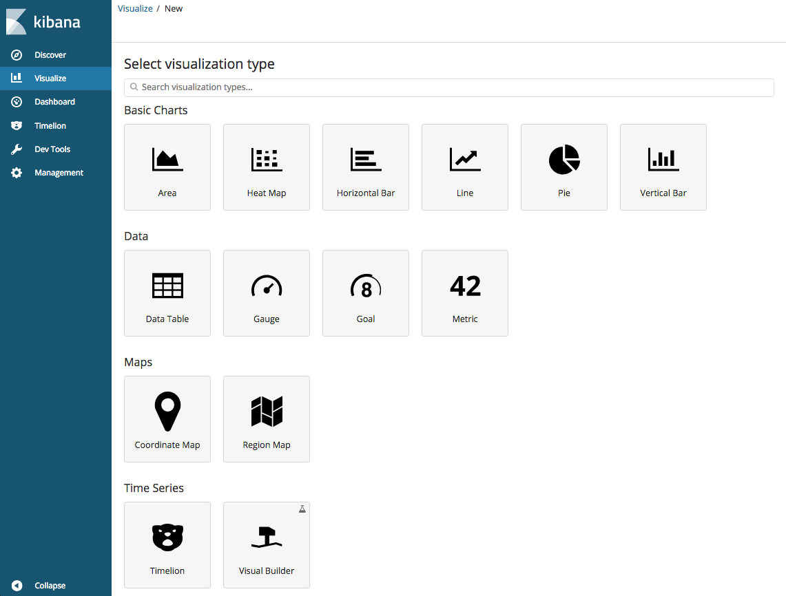

Click on `signup` to select it as the index used in the visualization

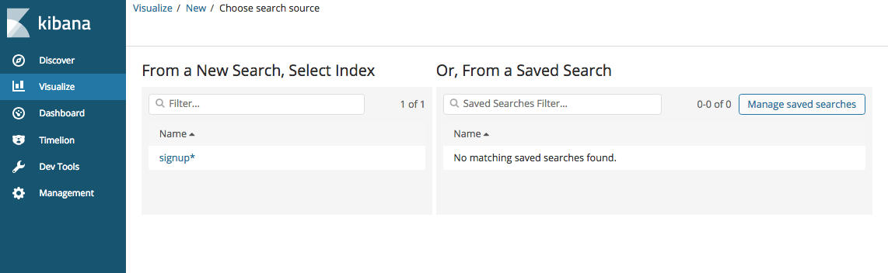

To create the visualiztion, click on the button next to `Y-Axis`. For `Aggregation`, select `Average`. For `Field` select `age`. Type in `AGE` as `Custom Label`

Under `Buckets` select `X-Axis`. For `Aggregation` select `Terms` from the pulldown menu. Under `Field` select `userName.keyword` and for `Custom Label` type `User Name`.

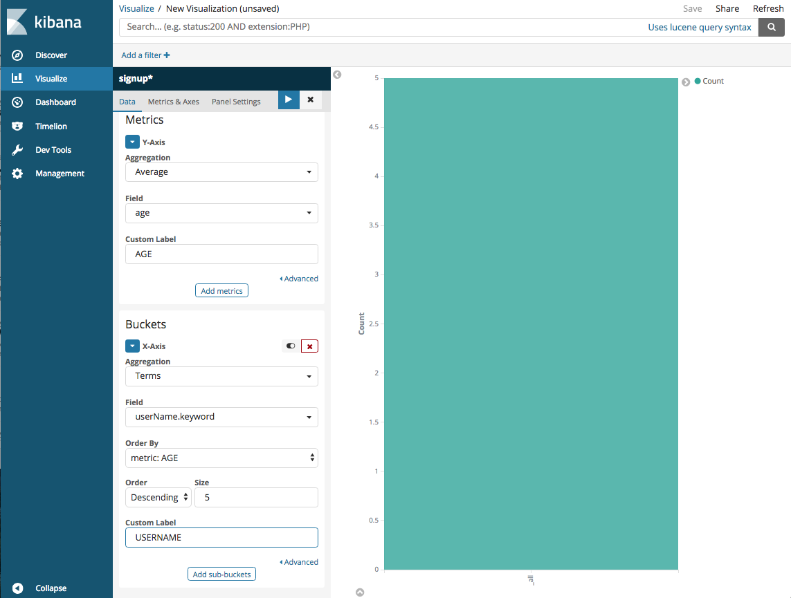

Finally, to display the barchart, click on the triangle in the blue box at the top of the configuration panel.

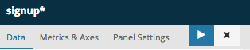

The visualization is a vertical bar chart of the ages of the people registered in the database.

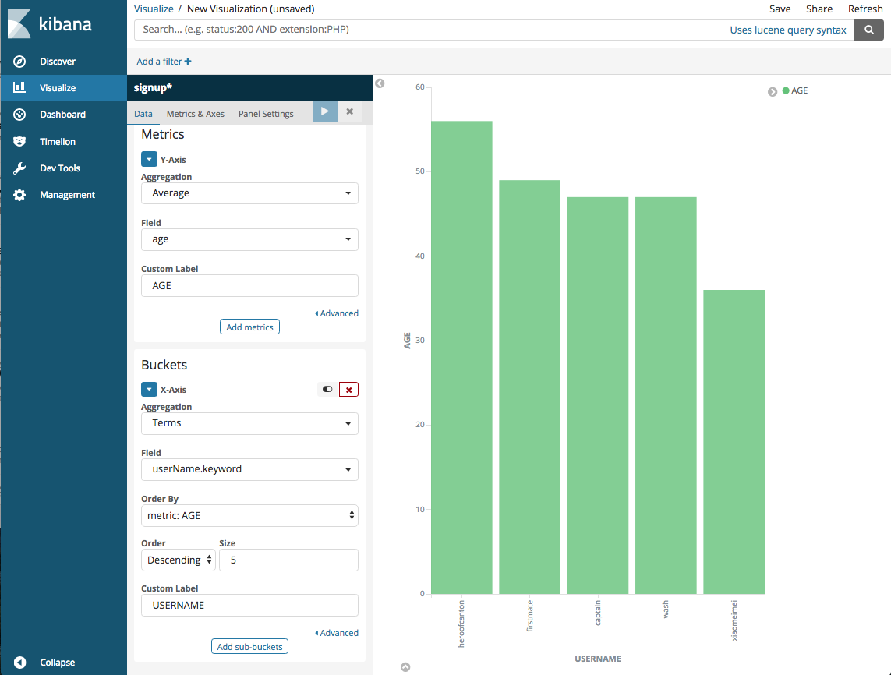

In this section, we added logging and visualization capabilities with only a minor change to our application. By modernizing a traditional Java application through adding microservices, we can add other services to improve the application.

## <a name="task5"></a>Task 5: Orchestration with Swarm

In Task 2 we modernized the java applicatio by adding microservices that will allow it to scale. This section we'll discuss the process of scaling the application to handle more requests.

### Number of Managers

The recommended number of managers for a production cluster is 3 or 5. A 3-manager cluster can tolerate the loss of one manager, and a 5-manager cluster can tolerate two instantaneous manager failures. Clusters with more managers can tolerate more manager failures, but adding more managers also increases the overhead of maintaining and committing cluster state in the Docker Swarm Raft quorum. In some circumstances, clusters with more managers (for example 5 or 7) may be slower (in terms of cluster-update latency and throughput) than a cluster with 3 managers and otherwise similar specs.

Managers in a production cluster should ideally have at least 16GB of RAM and 4 vCPUs. Testing done by Docker has shown that managers with 16GB RAM are not memory constrained, even in clusters with 100s of workers and many services, networks, and other metadata.

On production clusters, never run workloads on manager nodes. This is a configurable manager node setting in Docker Universal Control Plane (UCP).

### Worker Nodes Size and Count

For worker nodes, the overhead of Docker components and agents is not large — typically less than 1GB of memory. Deciding worker size and count can be done similar to how you currently size app or VM environments. For example, you can determine the app memory working set under load and factor in how many replicas you want for each app (for durability in case of task failure and/or for throughput). That will give you an idea of the total memory required across workers in the cluster.

By default, a container has no resource constraints and can use as much of a given resource as the host’s kernel scheduler allows. You can limit a container's access to memory and CPU resources. With the release of Java 10, containers running the Java Virtual Machine will comply with the limits set by Docker.

## <a name="task5.1"></a>Task 5.1: Configure Workloads to Only Run on Workers

Click on `Admin` > `Admin Settings` in the left menu sidebar.

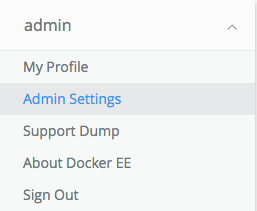

Click on `Scheduler` and under `Container Scheduling` uncheck the first option `Allow administrators to deploy containers on UCP managers or nodes running DTR`

## <a name="task5.2"></a>Task 5.2: Configuring Containers for Deployment

We'll use the Redis container as example on how to configure containers for production and go through the options.

```yaml
  redis:
    image: redis
    deploy:
      mode: replicated
      replicas: 3
    resources:
      limits:
        cpus: '0.5'
        memory: 50M
      reservations:
        cpus: '0.25'
        memory: 20M
    placement:
        constraints: [node.role == worker]
    restart_policy:
      condition: on-failure
      delay: 5s
      max_attempts: 3s
      window: 120s
    update_config:
          parallelism: 2
          delay: 10s
    ports:
      - "6379:6379"
    networks:
      - back-tier
```
### Deploy

The deploy directive sets the `mode` to either `global` which is one container per node or `replicated` which specifies the number of containers with the `replicas` parameters. The example launches 3 Redis containers.

### Resources

The `resources` directive sets the `limits` on the memory and CPU available to the container. `Reservations` ensures that the specified amount will always be available to the container.

### Placement

Placement specifies constraints and preferences for a container. Constraints let you specify which nodes where a task can be scheduled. For example, you can specify that a container run only on a worker node, as in the example. Other contraints are:

|node | attribute matches | example|
|-----|-------------------|--------|
|node.id | Node ID | node.id==2ivku8v2gvtg4 |
|node.hostname | Node hostname | node.hostname!=node-2|
|node.role | Node role | node.role==manager |
|node.labels |user defined node labels | node.labels.security==high|
|engine.labels |Docker Engine's labels	|engine.labels.operatingsystem==ubuntu 14.04 |

Preferences divide tasks evenly over different categories of nodes. One example of where this can be useful is to balance tasks over a set of datacenters or availability zones. For example, consider the following set of nodes:

* Three nodes with node.labels.datacenter=east
* Two nodes with node.labels.datacenter=south
* One node with node.labels.datacenter=west

Since we are spreading over the values of the datacenter label and the service has 9 replicas, 3 replicas will end up in each datacenter. There are three nodes associated with the value east, so each one will get one of the three replicas reserved for this value. There are two nodes with the value south, and the three replicas for this value will be divided between them, with one receiving two replicas and another receiving just one. Finally, west has a single node that will get all three replicas reserved for west.

### Restart Policy

Restart_policy configures if and how to restart containers when they exit. restart.

* `condition`: One of none, on-failure or any (default: any).
* `delay`: How long to wait between restart attempts, specified as a duration (default: 0).
* `max_attempts`: How many times to attempt to restart a container before giving up (default: never give up). 
* `window`: How long to wait before deciding if a restart has succeeded, specified as a duration (default: decide immediately).

### Update Config

Update_config configures how the service should be updated. Useful for configuring rolling updates.

* `parallelism`: The number of containers to update at a time.
* `delay`: The time to wait between updating a group of containers.
* `failure_action`: What to do if an update fails. One of continue, rollback, or pause (default: pause).
* `monitor`: Duration after each task update to monitor for failure (ns|us|ms|s|m|h) (default 0s).
* `max_failure_ratio`: Failure rate to tolerate during an update.
* `order`: Order of operations during updates. One of stop-first (old task is stopped before starting new one), or start-first (new task is started first, and the running tasks briefly overlap) (default stop-first) 

## <a name="task5.3"></a>Task 5.3: Deploying in Production

Deploy the application as an application stack in Docker EE

```yaml
version: "3.3"

services:

  database:
    image: <$DTR_HOST>/backend/database
    deploy:
      placement:
        constraints: [node.role == worker]
    environment:
      MYSQL_ROOT_PASSWORD: /run/secrets/mysql_root_password
    ports:
      - "3306:3306"
    networks:
      - back-tier
    secrets:
      - mysql_root_password

  webserver:
    image: <$DTR_HOST>/frontend/java_web:2
    deploy:
      mode: replicated
      replicas: 2
      restart_policy:
        condition: on-failure
        delay: 5s
        max_attempts: 3
        window: 120s
      placement:
        constraints: [node.role == worker]
      resources:
        limits:
          cpus: '0.75'
          memory: 786M
        reservations:
          cpus: '0.5'
          memory: 512M
      update_config:
        parallelism: 2
        delay: 10s
    ports:
      - "8080:8080"
    environment:
      BASEURI: http://messageservice:8090/user
    networks:
      - front-tier
      - back-tier

  messageservice:
    image: <$DTR_HOST>/backend/messageservice
    deploy:
      mode: replicated
      replicas: 1
      restart_policy:
        condition: on-failure
        delay: 10s
        max_attempts: 3
        window: 120s
      placement:
        constraints: [node.role == worker]
    ports:
      - "8090:8090"
    networks:
      - back-tier

  worker:
    image: <$DTR_HOST>/backend/worker:2
    deploy:
      mode: replicated
      replicas: 1
      restart_policy:
        condition: on-failure
        delay: 10s
        max_attempts: 3
        window: 120s
      placement:
        constraints: [node.role == worker]
    networks:
      - back-tier
      - front-tier

  redis:
    image: redis
    deploy:
      mode: replicated
      replicas: 1
      restart_policy:
        condition: on-failure
        delay: 5s
        max_attempts: 3
        window: 120s
      placement:
        constraints: [node.role == worker]
      resources:
        limits:
          cpus: '0.5'
          memory: 50M
        reservations:
          cpus: '0.25'
          memory: 20M
      update_config:
        parallelism: 2
        delay: 10s
    ports:
      - "6379:6379"
    networks:
      - back-tier

networks:
  front-tier:
    external: true
  back-tier:
    external: true

secrets:
  mysql_root_password:
    external: true
```
## <a name="task5.4"></a>Task 5.4: Visualize the Deployment

We can use the Docker Swarm visualizer to see the deployment graphically. To do this, go back to the master node terminal and run:

```bash
docker run -it -d -p 3000:8080 -v /var/run/docker.sock:/var/run/docker.sock dockersamples/visualizer
```

In your browser, go to http://<$UCP_HOST>:3000 to see the containers and how they are distributed across the cluster.

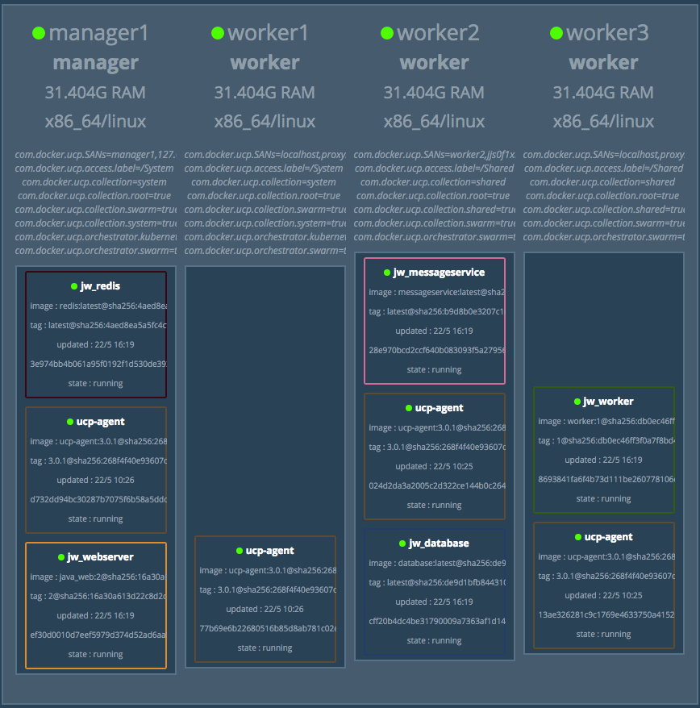

## <a name="task6"></a>Task 6: Deploying in Kubernetes

Docker EE gives you the choice of which orchestrator that you want to use. The same application that you deployed in Docker Swarm can be deployed in Kubernetes using a Docker Compose file or with Kubernetes manifests.

### <a name="task6.1"></a>Task 6.1: Configure Terminal

Kubernetes is an API and to connect to the API using the command line we will need to configure the terminal. This is done with a client bundle which contains the certificates to authenticate against the Kubernetes API.

We can download the client bundle from UCP by requesting an authentication token.

```bash
$ UCP_HOST=${1:<$UCP_HOST>}

$ ADMIN_USER=${2:-admin}

$ ADMIN_PASS=${3:-admin1234}

$ PAYLOAD="{\"username\": \"admin\", \"password\": \"admin1234\"}"

$ echo $PAYLOAD
{"username": "admin", "password": "admin1234"}

$ TOKEN=$(curl --insecure  -d "$PAYLOAD" -X POST https://"$UCP_HOST"/auth/login  | jq -r ".auth_token")
% Total    % Received % Xferd  Average Speed   Time    Time     Time  Current
                                 Dload  Upload   Total   Spent    Left  Speed
100   100  100    54  100    46    102     87 --:--:-- --:--:-- --:--:--   103

$ echo $TOKEN
211845cb-7751-4582-b880-f59252f61e18
``` 

Once we have a token, we can use it to get a client bundle and use it to configure the environment.

```bash
$ curl -k -H "Authorization: Bearer $TOKEN" https://"$UCP_HOST"/api/clientbundle > /tmp/bundle.zip

$ mkdir /tmp/certs-$TOKEN

$ pushd /tmp/certs-$TOKEN

$ unzip /tmp/bundle.zip

$ rm /tmp/bundle.zip

$ source /tmp/certs-$TOKEN/env.sh

$ popd
```

Test that the kubectl can connect to kubernetes.

```bash
$ kubectl get all
NAME             TYPE        CLUSTER-IP   EXTERNAL-IP   PORT(S)   AGE
svc/kubernetes   ClusterIP   10.96.0.1    <none>        443/TCP   6h
```  

### <a name="task6.2"></a>Task 6.2: Deploy Application in Kubernetes

It's beyond the scope of this tutorial to cover kubernetes indepth. However, if you're unfamiliar with kubernetes, here are some basic concepts.

Kubernetes uses abstractions to represent containerized workloads and their deployment. These abstractions are represented by objects and two of the basic objects are `pods` and `services`.

`Pods` are a single unit of deployment or a single application in kubernetes that may have or more containers. Pods are mortal which means that when they are destroyed they do not return. This means that pods do not have a stable IP. In order for a deployment that uses multiple pods that rely on each other, Kubernetes has `services` which defines a set of pods and a policy that defines how they are available.

Beyond basic objects, such as pods and services, is a higher level of abstraction called `controllers` that build on the basic objects to add functions and convenience features. A `replicaset` is a controller that creates and destroys pods dynamically. Another controller and higher level of abstraction is a `deployment` which provides the declarative updates for `pods` and `replicasets`. Deployments describe the desired end state of an application.

To run the application on Kubernetes, each part (webserver, database, messageservice, worker and redis) has been defined as a service and deployment. For each component, there's a specification that contains both the service and deployment that can be uploaded from the cloned repository.

1. Click on `Kubernetes` on the side bar menu and click `Create`

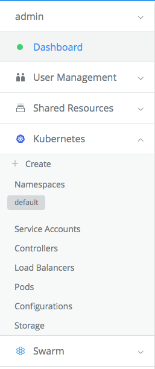

2. Select `default` for Namespace. Click on the `Click to upload a .yml file' to upload a file from your computer.

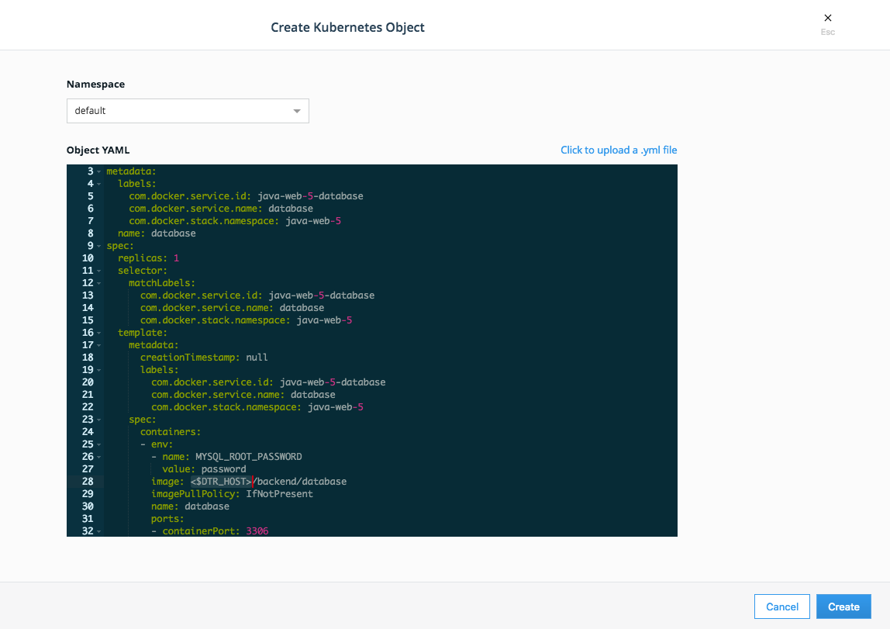

3. When the service is running, you can see the `Controllers` which include the `deployment` and `replicaset`

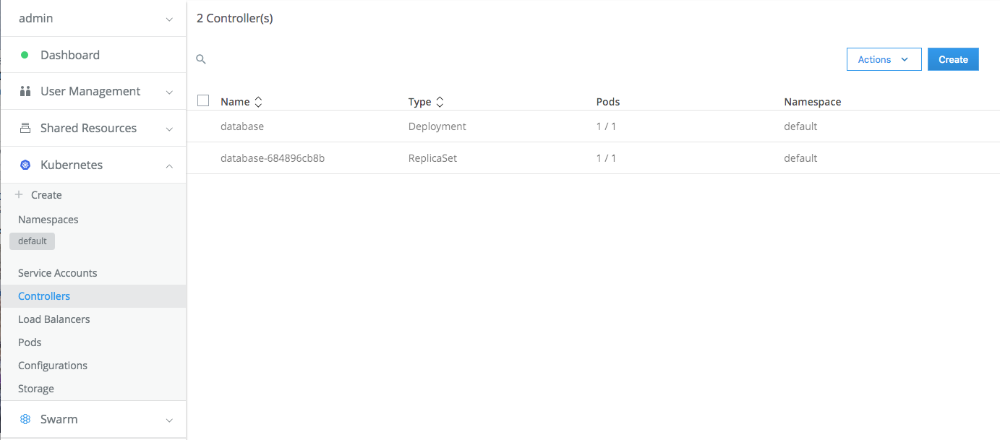

and the pods

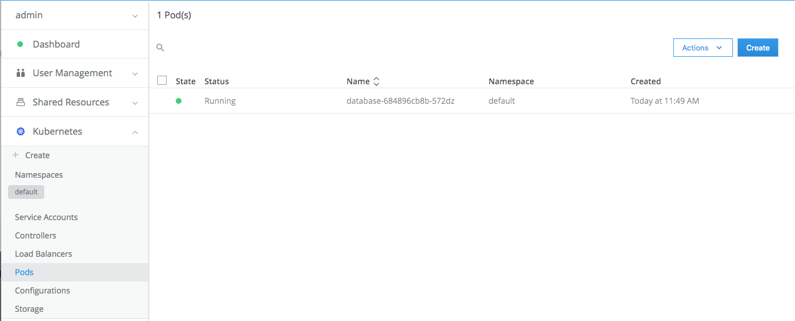

4. Repeat this step for webserver, messageservice, worker and redis components.

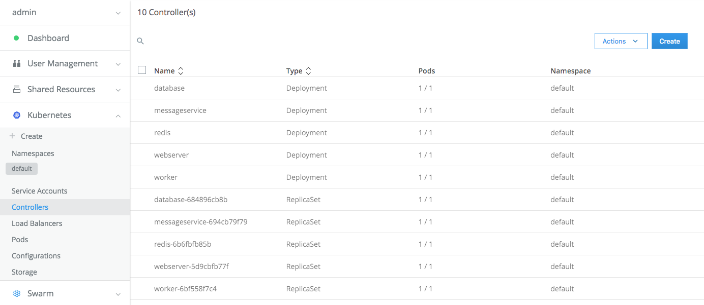

5. To see the application running, click on `Load Balancers` on the left side menu, click on `webserver` to display the webserver panel. Under `Ports` you'll see the URL for the application. Click on the link and add `java-web` to the url to get to the application.

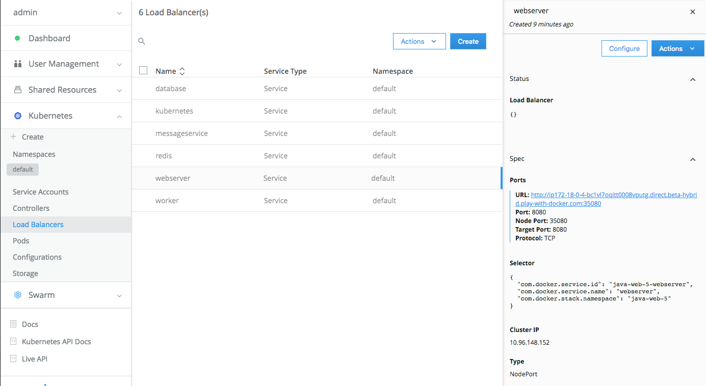

Note that the port number is different from the common port 8080 used by Tomcat. The webserver spec uses Kubernetes' `NodePort` publishing service which uses a predefined range of ports such as 35080. To use a different IP address or port outside the the range defined by nodePort, we can configure a pod as a proxy.

###  <a name="task6.3"></a>Task 6.3: Check out the Deployment on the Command Line

1. Go to the terminal window.

2. View all info on deployment:

```bash
$ kubectl get all
```
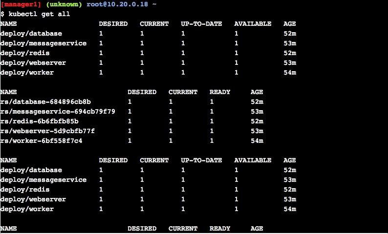

3. View info on pods

```bash
$ kubectl get pods
```
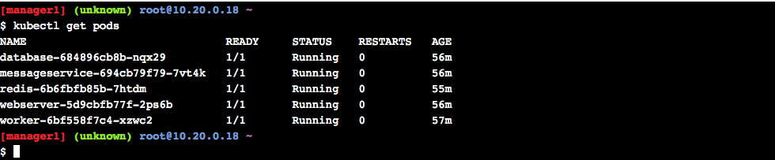

4. View info on services

```bash
$ kubectl get services
```

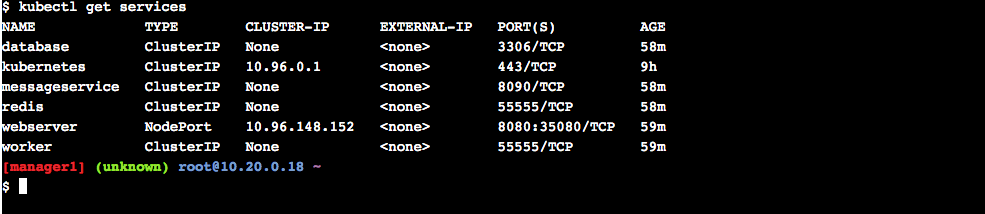

5. View info on deployments

```bash
$ kubectl get deployments
```

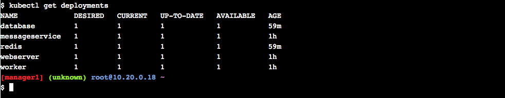


## Conclusion


### What we covered

We started with basic N-Tier monolithic application composed of a Java application and a relational database. As a first step, we first deployed the application as-is to see how it would run in a containerized environment. 

The next step was to determine if any parts of the application could be refactored to make it more scalable. One factor that affects application performance is multiple writes to the database. To address this bottleneck, we implemented a message service that writes the user data to Redis, a key-value data store, to hold the data until a worker service writes it the the database. The messaging queue was implemented with REST interface and we modified the Java app to send the data to the message service.

Implementing the message service opened up possibilities for adding new functions such as monitoring and visualization of the user data. We added Elasticsearch and Kibana containers to the stack and produced a visualization just by adding these services to the Docker Compose file.

In the following section, we looked at how to configure the application to deploy in a production environment by adding parameters that scaled and configured the services appropriately. We used another container to visualize the deployment across multiple containers.

In the final section, we changed the orchestrator from Docker Swarm to Kubernetes and deployed the application using Kubernetes. From the command line we queried the Kubernetes API about resources we deployed. We also were able to the same tasks using the Docker EE interface.

### Modernization Workflow

The modernization workflow is based on whether the application is whether the application is at the end of life or if the application will continue on as a business process. If the application is at the end of life, containerizing the application components might be sufficient for maintenance. Minor changes and patches can be rolled in as needed until the application is no longer needed. Section 2 of this tutorial covered the process of containerizing an existing application.

If the application is an ongoing business process, then piece wise modernization of the application is possible. Section 3 of this workshop covers how to take one aspect of an application and modernize the architecture. Section 4 covered how we can add new services because we extedend the architecture. Section 5 described how to configure an application for a production deployment using Swarm. The final section, showed how to deploy the same application using Kubernetes as an orchestrator. With Docker EE you have choice on how to deploy your application as well as environment to debug, monitor and manage your applications.

### Agility

In this tutorial we saw how easy it was to convert typical N-Tier Java CRUD application to containers and run them as an application in Docker EE. Tools such as multi-stage builds, Docker files, Docker Trusted Registry and Docker compose simplified the process of build, ship and run. We could also reuse components such as the database when modernizing the application and we could incorporate new capabilities such as monitoring and visualization with minor changes to the application. Docker EE provides a comprehensive platform for building, modernizing and deploying applications on cloud infrastructure.

### Choice

With Docker EE you have a choice. Whether your app is tied to a specific version of Java or you're building on the latest JVM, there are base images for application specific requirements. EE also supports Windows containers so you can run hybrid workloads to take advantage of both Windows and Linux applications. Docker EE supports both Docker Swarm and Kubernetes, you can pick the right solution for the application with out lock in.


## Call to Action

### Download Docker EE
### MTA
### Docker Associate Certification